# Architecture Diagram

```mermaid
flowchart LR
    A[Synthetic Healthcare Claims Data] --> B[AWS S3 Landing Zone Concept]
    B --> C[Databricks PySpark Processing]
    C --> D[Data Cleansing and Standardization]
    D --> E[Delta Lake Bronze Layer]
    E --> F[Delta Lake Silver Layer]
    F --> G[Delta Lake Gold Layer]
    G --> H[Data Quality Checks]
    H --> I[Claims Analytics Output]
    I --> J[Healthcare Reporting Dashboard]
```



## Architecture Explanation

This project demonstrates a healthcare claims lakehouse pattern using Databricks, PySpark, Delta Lake, AWS S3 concepts, and SQL based data quality checks.

1. Synthetic healthcare claims data represents incoming claims records.
2. AWS S3 landing zone concept represents raw file storage.
3. Databricks PySpark processing cleans and standardizes claim records.
4. Delta Lake layers organize claims data into bronze, silver, and gold layers.
5. Data quality checks validate claim identifiers, duplicate records, invalid amounts, and high value claims.
6. Curated output supports healthcare analytics and reporting.

## Lakehouse Layers

### Bronze Layer

Stores raw claims data as received from the landing zone.

### Silver Layer

Stores cleaned and standardized claim records after applying validation rules.

### Gold Layer

Stores curated claims summary data for reporting and analytics.

## Design Focus

- Healthcare claims processing
- Lakehouse architecture
- Databricks and PySpark processing pattern
- Delta Lake table organization
- Data quality validation
- Analytics-ready output
- PHI-safe synthetic portfolio data
```
